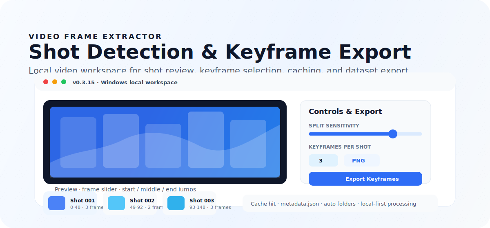

# VideoFrameExtractor

<p align="center">
  
</p>

<p align="center">
  <a href="LICENSE"></a>
  
  
  
</p>

<p align="center">
  Windows 本地视频镜头检测与关键帧提取工具。把长视频、广告片、素材片快速拆成可复查、可导出、可缓存的关键帧素材。
</p>

---

## 它解决什么

做 AIGC 训练集、素材库或分镜复查时，最烦的不是截图，而是重复看视频、找镜头、挑清晰帧、避免误切、整理导出文件夹。

VideoFrameExtractor 把这件事收敛成一个本地工作台：

- 检测镜头切分，支持缓存，下次打开同一个视频不用重新跑。
- 每个镜头自动挑选 1-6 张关键帧，也可以手动微调。
- 预览当前镜头的首帧、中间帧、尾帧，支持一键导出。
- 导出时自动建文件夹，附带 `metadata.json`，方便整理数据集。
- 所有处理默认在本地完成，不依赖云端服务。

## 30 秒开始

```bash
pip install -r requirements.txt
python main.py
```

Windows 上也可以直接双击：

```text
setup_windows.cmd   # 首次安装依赖
run_app.cmd         # 启动应用
```

## 工作流

```text
选择 / 拖入视频
      ↓
检测镜头并生成关键帧
      ↓
在大预览区复查镜头、拖动帧滑块、手动替换关键帧
      ↓
导出关键帧或导出当前 / 全部镜头首中尾帧
      ↓
获得图片文件夹 + metadata.json
```

## 核心能力

| 能力 | 说明 |
| --- | --- |
| 镜头检测 | 支持标准内容检测、自适应检测、直方图差异检测和混合增强模式。 |
| 参数滑块 | 用“切分灵敏度”和“运镜误切修正”控制检测倾向，减少直接调阈值的负担。 |
| 关键帧选择 | 按清晰度、信息量、对比度、曝光和色彩综合评分。 |
| 多帧输出 | 每个镜头可提取 1-6 张关键帧。 |
| 首中尾帧 | 支持当前镜头或全部镜头的首帧、中间帧、尾帧导出。 |
| 手动微调 | 镜头内滑块预览、上一帧/下一帧、设为当前关键帧。 |
| 检测缓存 | 自动缓存镜头结果和低分辨率特征，二次导入更快。 |
| 本地导出 | 自动创建独立导出文件夹，支持 PNG / JPG 和 `metadata.json`。 |

## 适合谁

- AIGC 训练数据集制作者
- 视频创作者、剪辑师、素材整理者
- 需要从广告片、短片、长片里快速提取代表性画面的人
- 想把镜头检测结果保存下来，在不同电脑间迁移的人

## 不适合什么

- 不是剪辑软件，不提供时间线剪辑和转场编辑。
- 不是云服务，不提供多人协作、云端转码或在线素材库。
- 不再内置“分镜视频片段导出”，这个功能更适合交给专业剪辑软件。

## 导出质量

- `PNG` 是无损图片格式，适合训练集和高质量素材整理。
- `JPG` 是有损格式，适合体积更小的预览或轻量归档。
- 导出的图片来自 OpenCV 对视频帧的解码结果；不会对图片额外做美化、锐化或风格化处理。
- 如果原视频是 HDR、杜比或特殊编码，最终效果取决于本机 OpenCV / FFmpeg 对该编码的解码能力。

## 长视频与缓存

- 检测过程按帧流式读取，不会把整部视频一次性载入内存。
- 混合检测中的 Content / Adaptive 逻辑已经合并为单次解码，减少长片重复扫描。
- 特征缓存只保存低分辨率分数与检测结果，不复制原视频。
- 缓存可在应用内清理：清当前视频缓存、清全部缓存、打开缓存目录、清空当前结果。

## 参数建议

| 场景 | 建议 |
| --- | --- |
| 1 小时电影 | 优先用默认混合模式；只追求速度时可切到标准内容检测。 |
| 快节奏广告 / 短视频 | 内容阈值 10-14，差异阈值 0.12-0.18。 |
| 电影 / 长镜头素材 | 内容阈值 18-27，差异阈值 0.20-0.30。 |
| 误切太多 | 提高差异阈值，或把最短镜头调到 0.5-1.0 秒。 |
| 想识别更多镜头 | 使用混合增强，降低内容阈值和差异阈值。 |
| 训练数据集 | 每镜头 2-3 帧通常比只取 1 帧更稳。 |

## 打包 Windows 便携版

在 Windows PowerShell 中运行：

```powershell
powershell -ExecutionPolicy Bypass -File .\build_portable.ps1
```

生成结果：

```text
release/VideoFrameExtractor-portable.zip
release/VideoFrameExtractor-source.zip
```

解压后运行：

```text
VideoFrameExtractor/VideoFrameExtractor.exe
```

## 项目结构

```text
video-frame-extractor/
├── assets/
│   ├── app_icon.ico
│   ├── app_icon.png
│   └── readme-hero.svg
├── core/
│   ├── feature_cache.py
│   ├── frame_selector.py
│   ├── image_saver.py
│   ├── shot_detector.py
│   └── video_processor.py
├── ui/
│   └── main_window.py
├── main.py
├── requirements.txt
├── build_portable.ps1
├── setup_windows.cmd
├── run_app.cmd
├── LICENSE
├── CONTRIBUTING.md
├── SECURITY.md
└── THIRD_PARTY_LICENSES.md
```

## 贡献与安全

- 贡献流程见 [CONTRIBUTING.md](CONTRIBUTING.md)。
- 安全与隐私注意事项见 [SECURITY.md](SECURITY.md)。
- 第三方依赖说明见 [THIRD_PARTY_LICENSES.md](THIRD_PARTY_LICENSES.md)。
- 请不要把原视频、检测缓存、导出图片或私人项目文件提交到仓库。
- 当前暂不接收未经过授权确认的外部代码贡献；提交 PR 前请先阅读贡献说明。

## License

VideoFrameExtractor community edition is released under the GNU General Public License v3.0. See [LICENSE](LICENSE).

Because this project uses PyQt5, GPLv3 is the intended license for the public community codebase.
